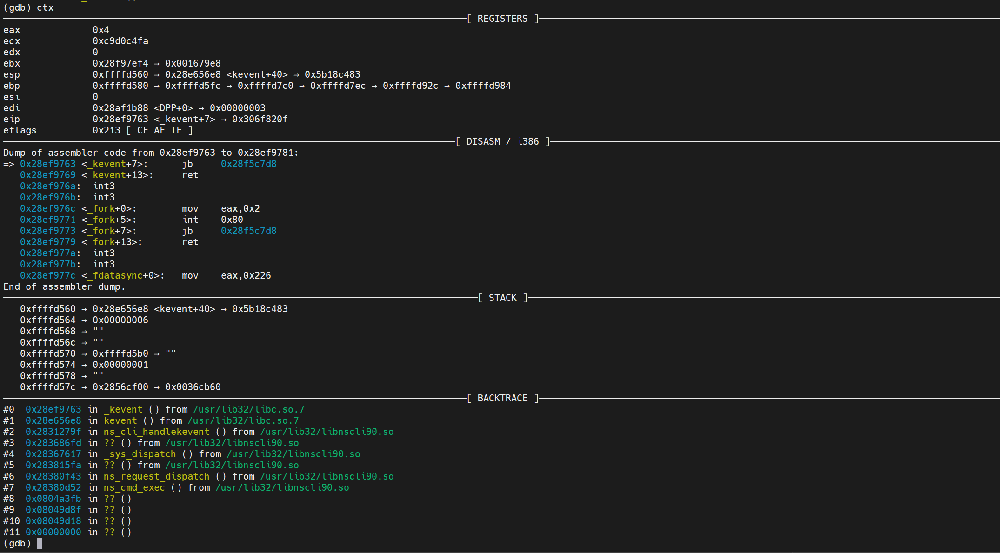

# rawdbg

Let the GDB is more convenient to use in reverse engineering ( without Python scripts )

### how to use

```shell
wget -O "$HOME/.rawdbg.gdb" https://github.com/binLep/rawdbg/raw/main/.rawdbg.gdb
echo "$HOME/.rawdbg.gdb" >> $HOME/.gdbinit
```

### example image


